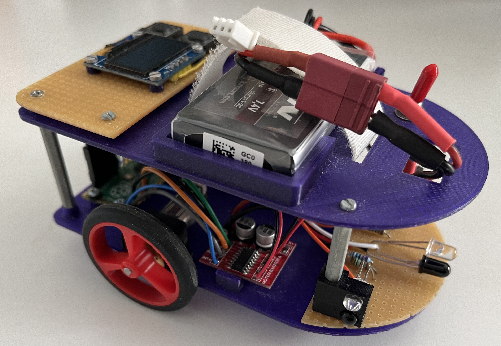
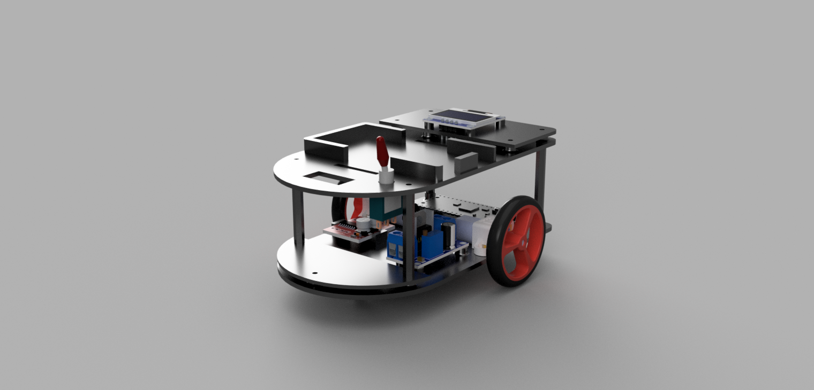
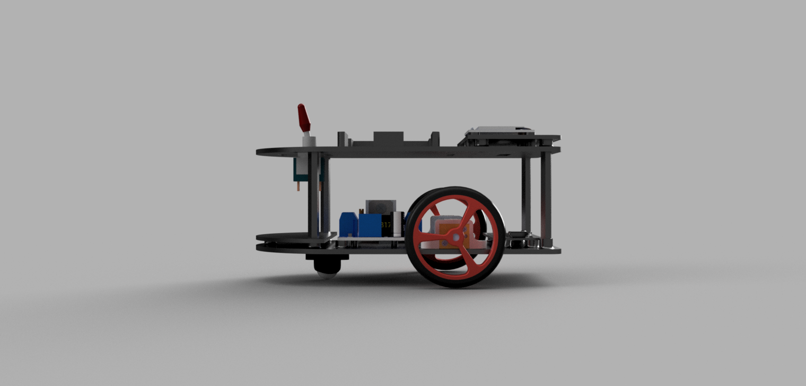
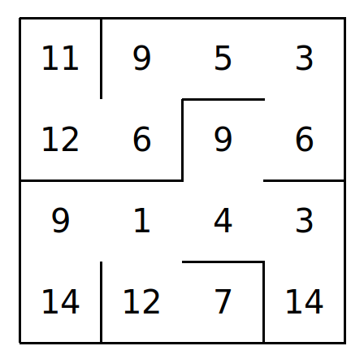

# Jureumi

Jureumi is a maze-solving robot built by **Mathias Suroviak**, **Lucia Hutirová** and **Lucia Eliška Grajciarová**. He was built as our [SOČ](https://siov.sk/sutaze/stredoskolska-odborna-cinnost/) project and to attend the [Micromouse](https://en.wikipedia.org/wiki/Micromouse) competition.

***

## Features
Although Jureumi is relatively simple in compare with other Micromouse robots, he contains all the necessary features to solve mazes:
- Drive through the maze using two brushed DC motors
- Detect obstacles - maze walls with custom made IR distance sensors
- Scan mazes, where all walls are connected, using [Right-hand rule]([https://en.wikipedia.org/wiki/Right-hand_rule](https://en.wikipedia.org/wiki/Maze-solving_algorithm#Hand_On_Wall_Rule))
- Save map of the maze to raspberry pi pico flash memory

***

## Components

| Component | Model | Quantity |
| --------- | ------ | -------- |
| Microcontroller | [Raspberry Pi Pico](https://www.raspberrypi.com/products/raspberry-pi-pico/) | 1 |
| Linear Regulator | LM317 Module | 1 |
| Motor | [Pololu 75:1 Gearmotor HP](https://www.pololu.com/product/2215) | 2 |
| Encoder | [Pololu Encoder 12 CPR](https://www.pololu.com/product/4761)| 2 |
| Wheel | [Pololu WHEEL 40×7MM - RED](https://www.pololu.com/product/1453) | 2 |
| Motor Driver | MX1508 Module | 1 |
| Ball Caster | [Pololu Ball Caster - 3/8″ Metal Ball](https://www.pololu.com/product/951) | 1 |
| IR LED | LL-503IRC2V-2AD | 3 |
| Phototransistor | BPV11F | 3 |
| Display | SSD-1306 OLED display | 1 |
| Battery | KAVAN Li-Po 350mAh/7,4V | 1 |

***

## Future improvements:
- More reliable distance sensors (sunlight cover, smaller detection angle, smaller light frequency range, ...)
- Advanced maze-solving algorithms (A*, Floodfill)
- Custom PCB including MCU
- Replace the linear voltage regulator with a buck converter

***

## Images
### Renders

### Visualized maze-map from robot's memory

